<picture>
  <source media="(prefers-color-scheme: dark)" srcset="profile-dark.svg">
  <source media="(prefers-color-scheme: light)" srcset="profile-light.svg">
  
</picture>

# Valerie Rwamba Munyi

**Building useful technology. Making security part of the process. Turning ideas into evidence.**

I'm Valerie, a technology builder and entrepreneur based in Nairobi, Kenya, working across **software development, cybersecurity, and release engineering**. My wider interests include **DevSecOps, AI applications, data privacy, and technology ventures**.

I created **CanaryGuard AI**, connecting release evidence, policy decisions, and deployment observations. I also lead **NextEdge Analytics**, a privacy-first web analytics venture. My portfolio shows application work, security decisions, academic projects, and the reasoning behind them.

I'm open to **roles and internships in software, cybersecurity, and DevSecOps**, alongside **AI and privacy-focused collaborations, open-source contributions, and relevant partnerships**. I bring practical project experience, an entrepreneurial perspective, and a commitment to learning through useful work.

[Portfolio & project walkthroughs](https://valerie-rwamba-munyi.vercel.app/) · [LinkedIn](https://www.linkedin.com/in/valerie-munyi-48587b2b6/) · [Email me](mailto:valerierwamba1@gmail.com) · [CV](https://valerie-rwamba-munyi.vercel.app/Valerie_Rwamba_Munyi_CV.pdf)

## Selected work

### 01 / CanaryGuard AI
**Release decisions that can be traced back to evidence.**

- **Problem:** Passing a build alone doesn't explain whether a change should be released or how a rollout behaved.
- **My work:** Connected validated release evidence, deterministic policy decisions, signed GitHub webhooks, and deployment observations under a stable release identity. Added PostgreSQL persistence and repository-scoped reporting.
- **Tools:** TypeScript, Node.js, PostgreSQL, Docker, GitHub Actions.
- **Evidence:** The repository documents its implemented MVP, tests, deployment workflows, API contracts, and limitations. AI advice stays separate from final policy authority; the default provider is a mock.

[Source & setup](https://github.com/RWAMBA/the-autonomous-canary) · [Architecture & walkthrough](https://valerie-rwamba-munyi.vercel.app/#works)

### 02 / Engineering portfolio
**A working route from project evidence to contact.**

- **Problem:** A project showcase needs clear contribution boundaries, accessible navigation, and a reliable way to get in touch.
- **My work:** Customized an inherited Next.js portfolio, clarified project evidence, improved keyboard and mobile interactions, and integrated validated server-side contact delivery through Formspree.
- **Tools:** Next.js, React, TypeScript, Tailwind CSS, Playwright, Vercel.
- **Evidence:** At the contact release, 13 automated tests and 19 browser tests passed; post-merge CI passed, and a live submission reached the confirmed inbox.

[Live portfolio](https://valerie-rwamba-munyi.vercel.app/) · [Project details](https://valerie-rwamba-munyi.vercel.app/#works)

### 03 / Innovation Club Management System
**Administrative workflows for a student club.**

- **Problem:** Club members, events, attendance, and reporting need one organized workflow.
- **My work:** Built an academic system with administrator, patron, and member workflows.
- **Tools:** PHP, MySQL, XAMPP.
- **Evidence:** KNEC academic project, 2026; project result: Distinction, Grade 1. Screens and context are available in the portfolio.

[Project walkthrough](https://valerie-rwamba-munyi.vercel.app/#works)

## Tools & technical foundation

**Application development:** TypeScript · JavaScript · Node.js · React · Next.js · REST APIs

**Data & delivery:** PostgreSQL · Supabase · Docker · Git · GitHub Actions · automated testing

**Security practices in my projects:** authentication · role-based access · webhook verification · input validation · privacy-conscious logging

## How I turn ideas into useful work

- Start with the user need and make my contribution explicit.
- Keep implementation, tests, and evidence close together.
- Treat CI results and deployment identity as evidence, with clear limits.
- Keep credentials and private client information outside public repositories.
- Document decisions so another engineer can understand and run the work.

## Learning & background

Diploma in ICT at Kiambu National Polytechnic: examinations completed; graduation expected November 2026. Previous ICT attachment at Kiambu County Government. Currently building security knowledge as an **ISC2 Candidate**.

## Let's build something useful

For a role, internship, collaboration, or partnership, tell me the problem you want to solve and where our work could connect. I welcome conversations about secure applications, AI-enabled tools, privacy-first products, and practical technology ventures.

**[Get in touch](https://valerie-rwamba-munyi.vercel.app/#contact)** · **[Explore the evidence](https://github.com/RWAMBA/the-autonomous-canary)**

The portrait is a full-frame ASCII conversion of my supplied photo, with its original proportions preserved. The SVGs are stored in this repository, adapt to light and dark mode, and respect reduced-motion preferences. GitHub's contribution calendar below shows my public activity.
